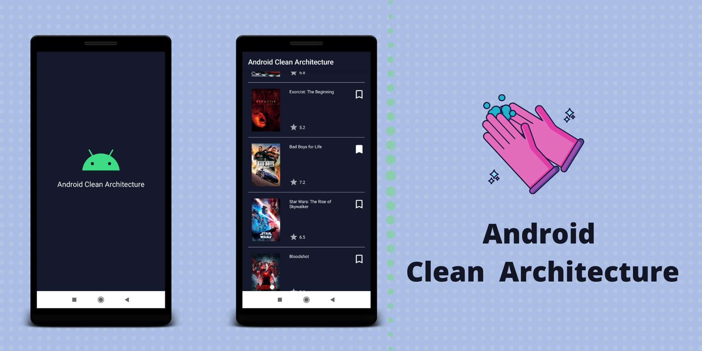

<p align="center">
 <center></a></center>
</p>

# Android Clean Architecture 
[](https://www.android.com)

[](LICENSE)


This is a sample movie list  Android application 📱 built to demonstrate use of *Clean Architecture* tools. Dedicated to all Android Developers with ❤️. 

***You can Install and test latest app from below 👇***

[](https://github.com/happysingh23828/raw/master/Android-Clean-Architecture/files/clean-arc.apk)

## How to build on your environment
Add your API key in **local.properties** file.
```xml
tmdb_api_key = YOUR_API_KEY
```
If you don't have tmdb api key you can create new key from [here](https://developers.themoviedb.org/3/getting-started/introduction).

## About
It simply loads **Popular Movies** list from [TMDB-API](https://www.themoviedb.org/)  and stores it in persistence storage (i.e. Room Database). Movies list will be always loaded from local database. Remote data (from API) and Local data is always synchronized.
It has feature of bookmark movie which will be stored locally.
- Modular approch followed
- It is heavily implemented by following standard clean architecture principle.
- Offline capability.
- It has cache expiration feature [5 minutes].
- Unit testing written for all layers.
- Multi Module Code Coverage reports using Jacoco.
- Android CI github action integration. 
- [S.O.L.I.D](https://en.wikipedia.org/wiki/SOLID) priciple followed for more understandable, flexible and maintainable.

### Disclaimer

Note: The use of clean architecture may seem over-complicated for this sample project. However, this allows us to keep the amount of boilerplate code to a minimum and also demonstrate the approach in a simpler form.

Clean Architecture will not be appropriate for every project, so it is down to you to decide whether or not it fits your needs 🙂

## Built With 🛠
- [Kotlin](https://kotlinlang.org/) - First class and official programming language for Android development.
- [Rx-Java](https://github.com/ReactiveX/RxJava) - For composing asynchronous and event-based programs by using observable sequences.
- [Android Architecture Components](https://developer.android.com/topic/libraries/architecture) - Collection of libraries that help you design robust, testable, and maintainable apps.
  - [LiveData](https://developer.android.com/topic/libraries/architecture/livedata) - Data objects that notify views when the underlying database changes.
  - [ViewModel](https://developer.android.com/topic/libraries/architecture/viewmodel) - Stores UI-related data that isn't destroyed on UI changes. 
  - [Room](https://developer.android.com/topic/libraries/architecture/room) - SQLite object mapping library.
- [Dagger 2](https://dagger.dev/) - Dependency Injection Framework
- [Retrofit](https://square.github.io/retrofit/) - A type-safe HTTP client for Android and Java.
- [OkHttp](http://square.github.io/okhttp/) - HTTP client that's efficient by default: HTTP/2 support allows all requests to the same host to share a socket
- [Glide](https://github.com/bumptech/glide) - image loading framework for Android
- [Gson](https://github.com/google/gson) - used to convert Java Objects into their JSON representation and vice versa.
- [Mockito](http://site.mockito.org/) - Most popular mocking framework for Java/kotlin.
- [Robolectric](http://robolectric.org/) - allows you to write unit tests and run them on a desktop JVM while still using Android API.
- [Stetho](https://github.com/facebook/stetho) - Stetho is a debug bridge for Android applications, enabling the powerful Chrome Developer Tools and much more.

## Clean Architecture

<center><p>- photo by: <a href="https://www.raywenderlich.com/3595916-clean-architecture-tutorial-for-android-getting-started">raywenderlich</a></p></center>

### What is clean architecture?
Architecture means the overall design of the project. It's the organization of the code into classes or files or components or modules. And it's how all these groups of code relate to each other. The architecture defines where the application performs its core functionality and how that functionality interacts with things like the database and the user interface.

### Why the cleaner approach?
1. Separation of code in different layers with assigned responsibilities making it easier for further modification.
2. High level of abstraction
3. Loose coupling between the code
4. Testing of code is painless
> Clean code always looks like it was written by someone who cares. - by Michael Feathers”

### Layers
- **Domain** - Would execute business logic which is independent of any layer and is just a pure kotlin/java package with no android specific dependency.
- **Data** - Would dispense the required data for the application to the domain layer by implementing interface exposed by the domain.
- **Presentation / framework** - Would include both domain and data layer and is android specific which executes the UI logic.

## Modules of App
  ###  app - [android module]
  It uses the all the components and class releated to Android Framework. It gets the data from presentation layer and shows on UI.
  
  ### buildSrc [[kotlin module]
  This module helps to list and manage all the dependencies of the app at one place. It has list of dependencies and versions of that dependencies.
  
  ### data [kotlin module]
  The Data layer is our access point to external data layers and is used to fetch data from multiple sources (the cache and remote in our case).
  
  ### cache [android module]
  The Cache layer handles all communication with the local database which is used to cache data.
  
  ### domain [kotlin module]
  The domain layer responsibility is to simply contain the UseCase instance used to retrieve data from the Data layer and pass it onto the Presentation layer. 
  
  ### presentation [android module]
  This layer's responsibility is to handle the presentation of the User Interface, but at the same time knows nothing about the user interface itself. This layer has no dependence on the Android Framework, it is a pure Kotlin module. Each ViewModel class that is created implements the ViewModel class found within the Architecture components library. This ViewModel can then be used by the UI layer to communicate with UseCases and retrieve data.
  
  ### remote [kotlin module]
  The Remote layer handles all communications with remote sources, in our case it makes a simple API call using a Retrofit interface. 

## Code Coverage Reports
This projects uses [jacoco plugin](https://www.jacoco.org/jacoco/) for generate code coverage reports. currently each modules generates seprate code reports.

  #### Java/Kotlin Modules
  Use `./gradlew jacocoTestReport`
  
  Reports location for each module-<br>
  `-/data/build/reports/jacoco/test/html/index.html`<br>
  `-/domain/build/reports/jacoco/test/html/index.html`<br>
  `-/remote/build/reports/jacoco/test/html/index.html`<br>

  #### Android Modules
  Use `./gradlew jacocoTestReportDebug`

  Reports location for each module-<br>
  `-/app/build/reports/jacoco/debug/index.html`<br>
  `-/cache/build/reports/jacoco/debug/index.html`<br>
  `-/presentattion/build/reports/jacoco/debug/index.html` <br>
 
  
## Current App's Architecture
This app uses [***MVVM (Model View View-Model)***](https://developer.android.com/jetpack/docs/guide#recommended-app-arch) architecture.

## Future Plans
1. Add another features, Showing the crew and cast list for a movie. 
2. Instrumentation test cases to be added.
3. Merge all code covergae reports at single place.
4. MvRx implementaion on the UI layer.
5. MVI implementation on the UI layer.
6. Reach code coverage atleast 80%.
7. Dark Mode theme etc.


## Thanks
A special thanks to the authors involved with this repository, they were a great resource during our learning!
- https://github.com/bufferapp/android-clean-architecture-mvi-boilerplate

## If this project helps you in anyway, show your love :heart: by putting a :star: on this project :v:


## Contributing

Please fork this repository and contribute back using
[pull requests](https://github.com/happysingh23828/Android-Clean-Architecture/pulls).

Any contributions, large or small, major features, bug fixes, are welcomed and appreciated
but will be thoroughly reviewed .

### Contact - Let's become friend
- [Androchef Blog](https://androchef.com/)
- [Androchef Youtube](https://www.youtube.com/channel/UCILhpbLSFkGzsiCYAeR30DA)
- [Github](https://github.com/happysingh23828)
- [Linkedin](https://www.linkedin.com/in/happpysingh23828/)


